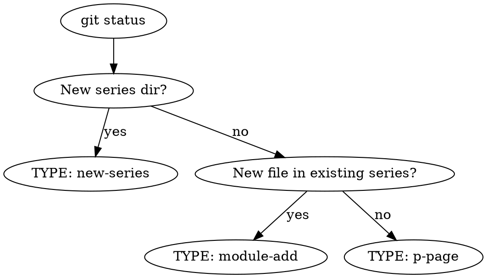

# Publish Private Content

Deploy private content pages (lectures, slides, workshops) to codemon.ai/partner/.
Full workflow: pre-flight → _meta.ts → index → build → commit → deploy → verify → DoD.

## Step 0 — Pre-flight

```bash
git status
```

Determine change type from modified/untracked files:



| Type | Signal | Steps needed |
|------|--------|--------------|
| **new-series** | New `pages/partner/<slug>/` dir | 1 + 2 + 3–7 |
| **module-add** | New `.mdx` in existing series dir | 1 + 3–7 |
| **p-page** | New `pages/p/<slug>.mdx` | 3–7 only |

## Step 1 — _meta.ts Update

### New series

1. Create `pages/partner/<slug>/_meta.ts`:

```ts
// Pattern: pages/partner/lecture-agency-ai/_meta.ts
export default {
  index: '강의 개요',
  '01': '모듈 제목',
  '02': '모듈 제목',
}
```

2. Add entry to `pages/partner/_meta.ts`:

```ts
// Pattern: pages/partner/_meta.ts
export default {
  index: '강의 자료',
  'lecture-agency-ai': 'AI 업무 자동화 강의',
  'lecture-startup-ai': '스타트업 AI 강의',  // ← new
  lecture: {
    title: '📺 강의 슬라이드',
    theme: { layout: 'raw' }
  },
}
```

**Rule:** `lecture` entry (raw layout) must always be LAST.

### Module add (existing series)

Add new page entry to the series `_meta.ts` only. No parent changes needed.

## Step 2 — Series Index Update (new-series only)

Append to `pages/partner/index.mdx` before the final line, following this pattern:

```mdx
---

## [강의 제목](/partner/<slug>)

한 줄 요약 | N개 모듈, 총 X시간

- **대상**: 타겟 오디언스
- **핵심**: 핵심 내용
- **목표**: 수강 후 기대 효과

[강의 개요 보기 →](/partner/<slug>)
```

Always add `---` separator before the new section.

## Step 3 — Local Build

```bash
env -i HOME=/Users/codemon PATH="/Users/codemon/.nvm/versions/node/v22.14.0/bin:/usr/bin:/bin:/usr/sbin:/sbin:/usr/local/bin" /bin/bash -c 'cd /Users/codemon/workspace/codemon/codemon-site && npm run build'
```

**Why `env -i`:** nvm hook in shell profile causes recursive spawn. Clean environment with explicit node path avoids this.

If build fails, fix the issue and re-run. Do NOT proceed to Step 4 with a broken build.

## Step 4 — Git Commit & Push

Stage specific files only (never `git add .`):

```bash
git add pages/partner/<slug>/_meta.ts
git add pages/partner/_meta.ts
git add pages/partner/index.mdx
git add pages/partner/<slug>/index.mdx
# ... any other changed files
git add docs/changelog/YYYY-MM-DD.md
git add docs/INDEX.md
```

Commit conventions:
- New series/page: `feat(partner): <제목>`
- Update existing: `deploy(partner): <내용>`

```bash
git push origin main
```

## Step 5 — Vercel Deploy (Prebuilt)

GitHub auto-deploy is **disabled**. Always use Vercel CLI prebuilt deploy:

```bash
env -i HOME=/Users/codemon PATH="/Users/codemon/.nvm/versions/node/v22.14.0/bin:/Users/codemon/Library/pnpm:/usr/bin:/bin:/usr/sbin:/sbin:/usr/local/bin" /bin/bash -c 'vercel build --prod'
env -i HOME=/Users/codemon PATH="/Users/codemon/.nvm/versions/node/v22.14.0/bin:/Users/codemon/Library/pnpm:/usr/bin:/bin:/usr/sbin:/sbin:/usr/local/bin" /bin/bash -c 'vercel deploy --prebuilt --prod'
```

**Do NOT** wait for auto-deploy after git push — it will not happen.

## Step 6 — Deploy Verification (playwright-cli)

```bash
playwright-cli open https://codemon.ai/partner/<slug>
playwright-cli screenshot --filename=deploy-verify.png
playwright-cli snapshot
```

Verify:
- Page loads (200, no error page)
- Title renders correctly
- Navigation works

Then check index page:

```bash
playwright-cli goto https://codemon.ai/partner
playwright-cli snapshot
```

Verify: new series link appears in index.

```bash
playwright-cli close
```

## Step 7 — DoD

1. **Changelog:** Create or update `docs/changelog/YYYY-MM-DD.md`

```markdown
# YYYY-MM-DD — <변경 요약>

## 주요 변경
- <bullet points>
```

2. **Index:** Update `docs/INDEX.md` "최근 주요 변경 (top 3)" — newest first, keep 3

**Include DoD files in Step 4 commit.** Write these before committing.

## Environment

| Tool | Path |
|------|------|
| node | `/Users/codemon/.nvm/versions/node/v22.14.0/bin/node` |
| npm | `/Users/codemon/.nvm/versions/node/v22.14.0/bin/npm` |
| npx | `/Users/codemon/.nvm/versions/node/v22.14.0/bin/npx` |
| vercel | `/Users/codemon/Library/pnpm/vercel` |

## Examples

### New series: `lecture-startup-ai`

```
Pre-flight  → pages/partner/lecture-startup-ai/ 신규 → TYPE: new-series
Step 1      → _meta.ts 생성 + partner/_meta.ts에 엔트리 추가
Step 2      → index.mdx에 강의 카드 추가
Step 3      → env -i ... npm run build
Step 4      → git add 5개 파일, feat(partner): 스타트업 AI 강의 페이지 추가
Step 5      → git push → auto deploy
Step 6      → playwright-cli verify /partner/lecture-startup-ai
Step 7      → changelog + INDEX.md (Step 4 커밋에 포함)
```

### Module add: `lecture-agency-ai/06`

```
Pre-flight  → 06.mdx in existing dir → TYPE: module-add
Step 1      → lecture-agency-ai/_meta.ts에 '06' 엔트리 추가
Step 2      → skip (기존 시리즈)
Step 3–7    → build → commit → push → verify → DoD
```

### /p/ page: `p/workshop-invite`

```
Pre-flight  → pages/p/workshop-invite.mdx → TYPE: p-page
Step 1–2    → skip
Step 3–7    → build → commit → push → verify → DoD
```

## Troubleshooting

| Issue | Fix |
|-------|-----|
| nvm recursive spawn on build | Use `env -i` clean environment (Step 3) |
| MDX compile error (unescaped `<`, `{`) | Wrap in backticks or use `{'<'}` escape |
| vercel `--prebuilt` 404 | Run `vercel build --prod` first, then `vercel deploy --prebuilt --prod` |
| Deploy 404 after push | Check `_meta.ts` entry matches directory name exactly |
| `lecture` entry not last in `_meta.ts` | Move `lecture: { ... }` block to end — raw layout must be last |
