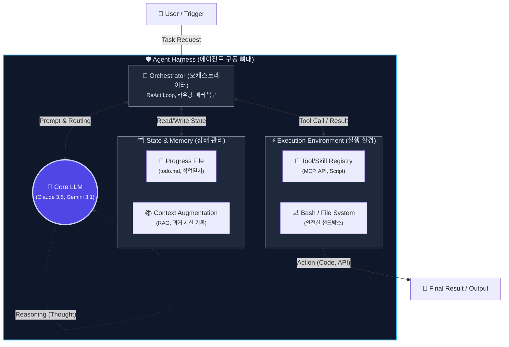

# LLM 벤치마크는 왜 현실 코딩에서 무너지는가: Harness 주도 에이전트 설계

> 2025년이 '모델'의 해였다면, 2026년은 '하네스(Harness)'의 해다. 모델이 똑똑해져도 에이전트가 무한 루프에 빠지는 진짜 이유와 그 해결책.

"최신 모델이 코딩 벤치마크에서 95%를 달성했습니다!"
매주 쏟아지는 새로운 LLM 발표에서 흔히 볼 수 있는 문구다. 우리는 환호하며 새로운 API 키를 발급받고 에이전트에 물린다. 

하지만 현실은 어떤가? 
조금만 복잡한 폴더 구조나 얽혀 있는 파일 스펙을 던져주면, 에이전트는 무한 루프에 빠지거나, 이미 실패한 방법을 반복하거나, 아예 처음에 뭘 하려고 했는지 목적을 잊어버린다. 분명 벤치마크 95%의 똑똑한 뇌를 가졌는데, 왜 내 프로젝트에서는 바보가 되는 걸까?

이 모순에 대한 해답을 한 iOS 1인 개발자의 실험과 우리의 OpenClaw 운영 경험을 바탕으로 정리해 보았다.

## EPIC Agent 벤치마크의 충격적 결과

퍼즐 풀기나 객관식 문제가 아닌, 변호사나 컨설턴트, 시니어 개발자가 수행하는 **'진짜 전문적인 업무'**를 테스트하는 EPIC Agent 벤치마크가 있다. 인간이 1~2시간 걸리는 복잡한 작업을 에이전트에게 맡긴 것이다.

결과는 충격적이었다. 벤치마크 90%를 넘나드는 최상위 프론티어 모델들의 **작업 성공률은 고작 24%**에 불과했다. 같은 모델에 8번의 기회를 줘도 성공률은 40%를 넘지 못했다.

연구원들이 실패 원인을 분석한 결과, 이유는 모델의 '지능' 부족이 아니었다. 모델은 필요한 지식을 모두 가지고 있었고, 문제를 추론하는 능력도 충분했다. 문제는 **'실행과 오케스트레이션(Orchestration)'**에 있었다.

에이전트들은 스텝이 길어지면 길을 잃었다. 방금 시도했다가 에러가 난 코드를 다시 적용하며 무한 루프를 돌거나, 처음 지시받은 마스터플랜을 망각하고 지엽적인 버그 픽스에 매몰되었다. 

Claude Code나 Cursor를 현업에서 하드코어하게 써본 개발자라면 누구나 한 번쯤 겪어본, 바로 그 '나선형 붕괴(Spiral)' 현상이다.

## 2026년은 '하네스(Harness)'의 해다

동일한 'Claude 3.5 Sonnet' 모델이라도, Claude Code 환경에서 돌릴 때와 Cursor에서 돌릴 때, 그리고 단순한 파이썬 스크립트에서 돌릴 때 그 퍼포먼스는 천지차이다.

결국 코딩 생산성을 결정하는 것은 엔진(LLM) 자체보다, 그 엔진을 감싸고 있는 뼈대, 즉 **'하네스(Harness)'**다. 

내 프로젝트 환경에 완벽하게 세팅된 하네스를 갖춘 낡은 모델이, 프롬프트 창만 덩그러니 있는 최신 모델보다 훨씬 더 많은 일을 안정적으로 처리한다. 1인 개발자에게 이것은 엄청난 희소식이다. 새로운 모델이 출시될 때까지 기다릴 필요 없이, 지금 당장 내 환경의 하네스를 개선하는 것만으로 생산성을 퀀텀 점프시킬 수 있기 때문이다.

## "하네스(Harness)"의 기술적 아키텍처 해부

"LLM은 그저 텍스트 예측기일 뿐이다. 하네스가 그것을 '에이전트'로 만든다."

최신 Agentic Workflow 패턴(Hugging Face, AWS Prescriptive Guidance 등)을 분석해 보면, 하네스는 단순한 껍데기가 아닙니다. LLM의 추론(Reasoning)을 실제 물리적인 '행동(Action)'으로 안전하고 정확하게 변환해 주는 오케스트레이션(Orchestration) 아키텍처입니다.

생산성 높은 하네스는 다음 4가지 핵심 컴포넌트를 갖춥니다.

1. **오케스트레이터 (Orchestrator)**
   단순한 프롬프트 전달을 넘어 **Thought-Action-Observation (TAO)** 루프를 통제합니다. LLM이 무한 루프에 빠지면 끊어주고(Max Iteration 제어), 에러가 나면 재시도(Self-Correction)를 지시하는 메인 컨트롤러입니다.
2. **상태 관리와 영속성 (State & Memory)**
   앞서 언급한 `Progress File` 패턴입니다. LLM의 컨텍스트 윈도우는 휘발성 메모리(RAM)와 같습니다. 하네스는 진행 상황을 물리적 마크다운 파일이나 DB에 실시간으로 쓰고 읽게 만들어(Disk), 에이전트의 단기 기억상실증을 막아줍니다.
3. **실행 샌드박스 (Execution Environment)**
   모델이 환각(Hallucination)으로 엉뚱한 코드를 짜도 시스템이 망가지지 않도록 격리된 터미널(Bash)과 파일 시스템 권한을 제공합니다.
4. **도구 및 스킬 레지스트리 (MCP & Skills)**
   외부 API나 특수 기능을 하드코딩하지 않고, **Model Context Protocol(MCP)**이나 모듈화된 스킬 파일 형태로 제공합니다. 엔진(LLM)이 언제든 플러그인처럼 꺼내 쓸 수 있는 무기고입니다.

\n## 솔로 개발자를 위한 강력한 에이전트 하네스 3계명

현실 코딩에서 에이전트가 길을 잃지 않게 만드는 하네스 구축의 핵심은 세 가지다.

### 1. 도구 다이어트 (Strip it down)
개발자들은 흔히 에이전트를 위해 복잡한 파이프라인과 특수 툴들을 잔뜩 만들어 붙인다. 하지만 과도한 도구는 에이전트의 판단력을 흐리게 한다. 
모든 특수 툴을 제거하고, 딱 두 가지만 줘라: **Bash 터미널 접근권**과 **파일 시스템 읽기/쓰기 권한**. 
프론티어 모델들은 당신이 짠 파이프라인보다 똑똑하다. 기본 도구만 쥐여주면 그들은 스스로 스크립트를 짜고 도구를 만들어 문제를 해결한다.

### 2. 진행 상태 파일의 영속화 (Progress File)
이것이 하네스의 핵심이다. 에이전트가 무한 루프에 빠지는 이유는 컨텍스트 윈도우 안에서 방향성을 잃기 때문이다.
우리의 OpenClaw 시스템 역시 `TODO.md`, `MEMORY.md`, `작업일지.md` 같은 마크다운 파일을 활용한다. 에이전트는 작업을 시작할 때 이 파일을 읽어 '현재 위치'를 파악하고, 하나의 액션이 끝날 때마다 이 파일에 결과를 기록(Write)한다.
기억을 LLM의 컨텍스트(RAM)에 의존하지 않고, 물리적인 파일 시스템(Disk)에 영속화하는 것이다. 이것이 에이전트의 닻(Anchor) 역할을 한다.

### 3. MCP와 Skills 도입
도구를 줄이라고 해서 외부 연동을 하지 말라는 뜻은 아니다. 핵심은 '하드코딩'을 피하라는 것이다.
Model Context Protocol (MCP)이나 독립적인 Skill 구조를 채택하라. 우리 팀이 `blog-publish`나 `nano-banana-pro` 같은 스킬을 `.md` 파일 형태로 분리해 둔 것처럼, 에이전트가 필요할 때 읽고 버릴 수 있는 모듈형 지식과 도구를 제공해야 한다.

## 맺음말: 모델을 탓하기 전에

"이번 제미나이는 멍청하네", "오퍼스 폼 다 죽었네." 
어제까지만 해도 우리 팀에서 나왔던 이야기다. 

하지만 진짜 문제는 툴을 사용하는 방식에 있었다. 모델이 중간에 길을 잃는다면, 그것은 모델의 한계라기보다 우리의 하네스(Harness)가 그만큼 헐겁게 설계되었다는 방증이다.

벤치마크 점수에 일희일비하는 것을 멈추자. 대신, 내 에이전트가 언제든 읽고 쓸 수 있는 단단한 마크다운 파일 하나를 프로젝트 루트에 만들어주는 것부터 시작해 보자. 

---
*작성: 코드몬 & 로디 🦊 | 2026-02-27*