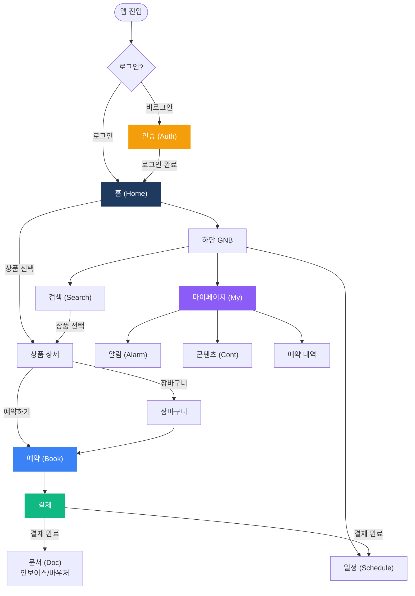

# BlueMango v2 — 비즈니스 로직 플로우차트

> **작성일**: 2026-03-17
> **대상**: COO, PM
> **목적**: v2 고객 사이트 전체 비즈니스 로직을 10개 카테고리 플로우차트로 시각화

---

## IA 요약

| 구분 | 항목 수 | 비고 |
|------|---------|------|
| **고객 사이트 총 화면** | 110개 TC | 10개 카테고리 |
| **필수 (soft open)** | 104개 | 구현 완료 |
| **2차개발** | 4개 | 추가계약 범위 |
| **미착수** | 2개 | PG전환, 알림 발송 |

---

## 플로우차트 목록

| # | 카테고리 | 항목 수 | Page ID 범위 | 링크 |
|---|---------|---------|-------------|------|
| 1 | **인증 (Auth)** | 10개 | AUTH-01 ~ AUTH-10 | [바로가기](/p/f7dedba217d8432a) |
| 2 | **홈 (Home)** | 16개 | HOME-01~06, PROD-01~10 | [바로가기](/p/ca0620aab9c04dca) |
| 3 | **예약 (Book)** | 24개 + 2차 4개 | BOOK-01~12, CART-01~12, PLAN-03~06 | [바로가기](/p/ba3284c8b2ba425c) |
| 4 | **마이페이지 (My)** | 15개 | MYPAGE-01 ~ MYPAGE-15 | [바로가기](/p/95504864f1c24e0b) |
| 5 | **문서 (Doc)** | 4개 + 2차 1개 | DOC-01~04, PLAN-03 | [바로가기](/p/0f4a4260b87343e6) |
| 6 | **콘텐츠 (Cont)** | 6개 | CONT-01 ~ CONT-06 | [바로가기](/p/4b4ad321c2f147b7) |
| 7 | **일정 (Schedule)** | 15개 | SCHED-01 ~ SCHED-15 | [바로가기](/p/e1ca39dd2b9747b1) |
| 8 | **공통 GNB** | 4개 | GNB-01 ~ GNB-04 | [바로가기](/p/245920d075a94323) |
| 9 | **알림 (Alarm)** | 2개 | HOME-06, MYPAGE-11 | [바로가기](/p/2d4f946988bd468c) |
| 10 | **검색 (Search)** | 10개 | SRCH-01 ~ SRCH-10 | [바로가기](/p/19275f235b384660) |

---

## 전체 사용자 흐름

---

## 2차개발 범례

> 🟠 점선+주황색 노드 = **2차개발 항목** (추가계약 범위)

| Page ID | 기능 | 설명 |
|---------|------|------|
| PLAN-03 | PDF 자동생성 | 인보이스/바우처 서버 자동 PDF 생성 |
| PLAN-04 | 패키지 상품 | 여러 상품 묶음 판매 (호텔+골프+차량) |
| PLAN-05 | 2단계 결제 | 계약금 → 잔금 분할납부 |
| PLAN-06 | 무통장 자동화 | PayAction 가상계좌 자동 입금확인 |

이 4개 항목은 [예약 (Book) 플로우차트](/p/ba3284c8b2ba425c)와 [문서 (Doc) 플로우차트](/p/0f4a4260b87343e6)에서 점선+주황색으로 구분 표시됩니다.

---

## 참고 문서

- [클라이언트 공유 문서](/p/ca28263d909c4005) — v2 전체 프로젝트 문서 허브
- [정보 구조 (IA) PRD](/p/b89666fb710e4fe6) — 고객 42페이지 + 어드민 35화면
- [기능 명세서](/p/b9e498d7bc4949ae) — v2 전체 기능 목록

---

*이 문서는 BlueMango v2 고객 사이트 IA를 기반으로 작성되었습니다.*
