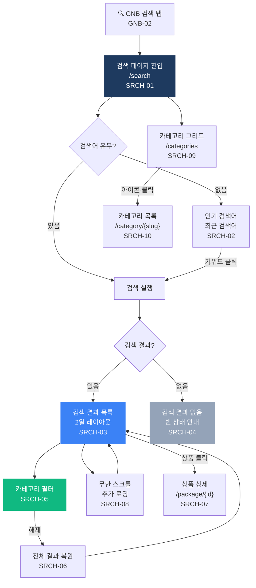

# 검색 (Search) 플로우차트

> IA 항목: SRCH-01 ~ SRCH-10 | 총 10개 화면

## 플로우차트

## 항목 매핑

| Page ID | 화면명 | 설명 | soft open |
|---------|--------|------|-----------|
| SRCH-01 | 검색 페이지 | 검색바 자동 포커스, 인기/최근 검색어 노출 | 필수 |
| SRCH-02 | 인기 검색어 | 클릭 시 자동 검색 실행 | 필수 |
| SRCH-03 | 검색 결과 목록 | 2열 레이아웃, 결과 개수 표시 | 필수 |
| SRCH-04 | 결과 없음 | 빈 상태 안내 메시지 | 필수 |
| SRCH-05 | 카테고리 필터 | 드롭다운 카테고리 선택 → 필터링 | 필수 |
| SRCH-06 | 필터 해제 | 전체 선택 → 전체 결과 복원 | 필수 |
| SRCH-07 | 상품 카드 클릭 | 상품 상세 페이지 이동 | 필수 |
| SRCH-08 | 무한 스크롤 | 하단 스크롤 시 추가 로딩 | 필수 |
| SRCH-09 | 카테고리 그리드 | 카테고리 아이콘 그리드 표시 | 필수 |
| SRCH-10 | 카테고리 아이콘 클릭 | /category/{slug} 이동 | 필수 |

---

*[← 인덱스로 돌아가기](/p/13a43c2544094357)*
