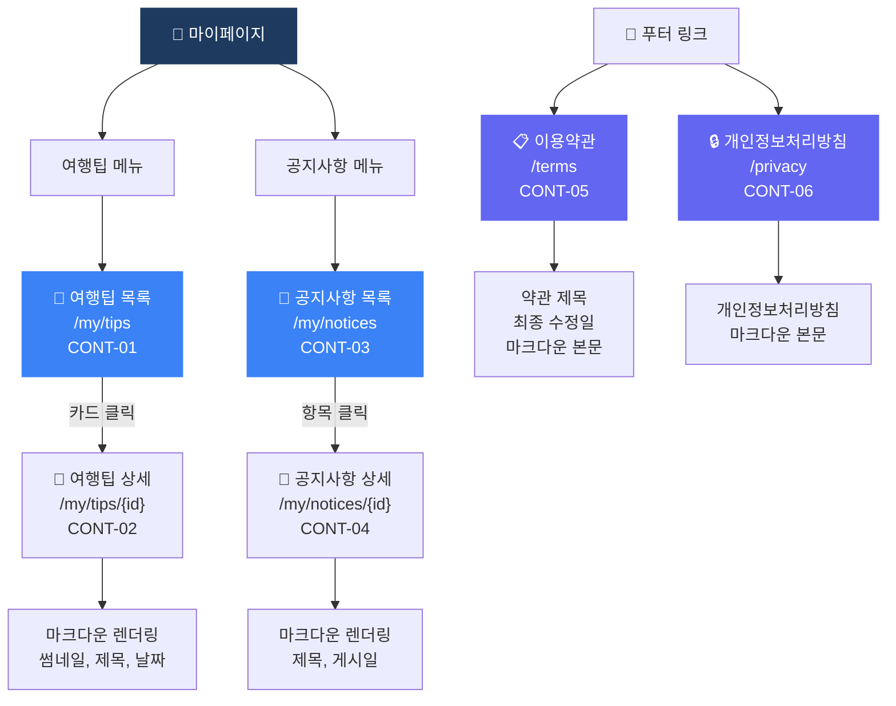

# 콘텐츠 (Content) 플로우차트

> IA 항목: CONT-01 ~ CONT-06 | 총 6개 화면

## 플로우차트

## 항목 매핑

| Page ID | 화면명 | 설명 | soft open |
|---------|--------|------|-----------|
| CONT-01 | 여행팁 목록 | 썸네일, 제목, 요약, 날짜 카드 표시 | 필수 |
| CONT-02 | 여행팁 상세 | 마크다운 렌더링 전체 콘텐츠 | 필수 |
| CONT-03 | 공지사항 목록 | 제목, 게시일 항목 표시 | 필수 |
| CONT-04 | 공지사항 상세 | 마크다운 렌더링 전체 콘텐츠 | 필수 |
| CONT-05 | 이용약관 | DB terms 테이블 → react-markdown 렌더링 | 필수 |
| CONT-06 | 개인정보처리방침 | DB terms 테이블 → react-markdown 렌더링 | 필수 |

---

*[← 인덱스로 돌아가기](/p/13a43c2544094357)*
