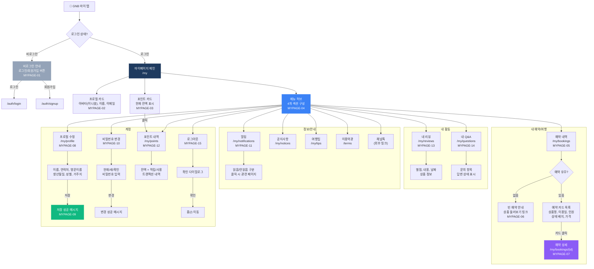

# 마이페이지 (My) 플로우차트

> IA 항목: MYPAGE-01 ~ MYPAGE-15 | 총 15개 화면

## 플로우차트

## 항목 매핑

| Page ID | 화면명 | 설명 | soft open |
|---------|--------|------|-----------|
| MYPAGE-01 | 비로그인 상태 | 로그인/회원가입 버튼 + 안내 메시지 | 필수 |
| MYPAGE-02 | 프로필 카드 | 아바타(이니셜), 이름, 이메일 | 필수 |
| MYPAGE-03 | 포인트 카드 | 현재 잔액, 클릭 시 /my/points 이동 | 필수 |
| MYPAGE-04 | 메뉴 구성 | 4개 섹션 (예약여행/활동/정보안내/계정) | 필수 |
| MYPAGE-05 | 예약 내역 | 상품명, 이용일, 인원, 상태, 가격 카드 | 필수 |
| MYPAGE-06 | 빈 예약 | 클립보드 아이콘 + 안내 + 상품 둘러보기 | 필수 |
| MYPAGE-07 | 예약 상세 | 상품명, 날짜, 인원, 결제정보 상세 | 필수 |
| MYPAGE-08 | 프로필 수정 | 이름, 연락처, 영문이름 등 편집 폼 | 필수 |
| MYPAGE-09 | 프로필 저장 | 저장 성공 메시지 표시 | 필수 |
| MYPAGE-10 | 비밀번호 변경 | 현재/새/확인 비밀번호 → 변경 완료 | 필수 |
| MYPAGE-11 | 알림 목록 | 읽음/안읽음 구분, 관련 페이지 이동 | 필수 |
| MYPAGE-12 | 포인트 내역 | 잔액 + 적립/사용 트랜잭션 목록 | 필수 |
| MYPAGE-13 | 내 리뷰 | 별점, 내용, 날짜, 상품 정보 카드 | 필수 |
| MYPAGE-14 | 내 Q&A | 문의 항목 + 답변 상태 | 필수 |
| MYPAGE-15 | 로그아웃 | 확인 다이얼로그 → 홈 이동 | 필수 |

---

*[← 인덱스로 돌아가기](/p/13a43c2544094357)*
