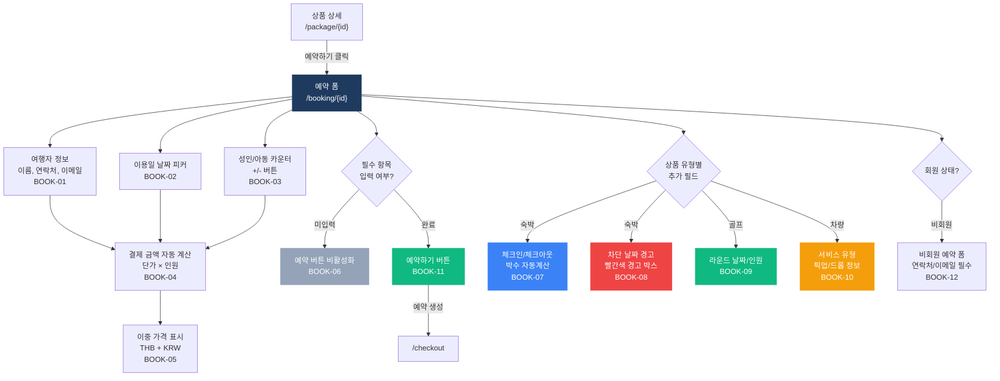
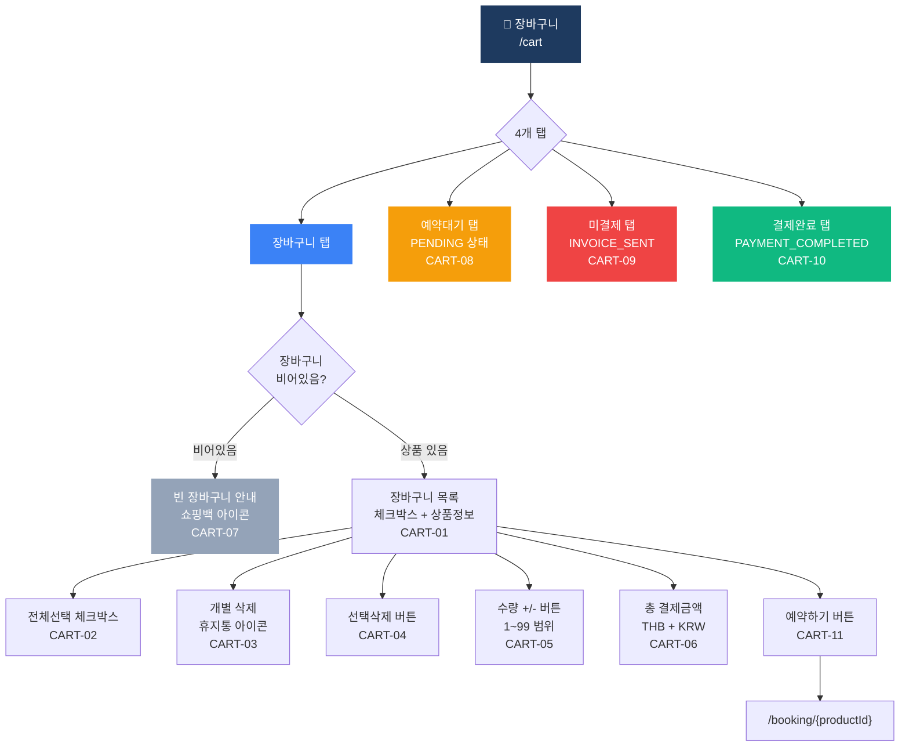
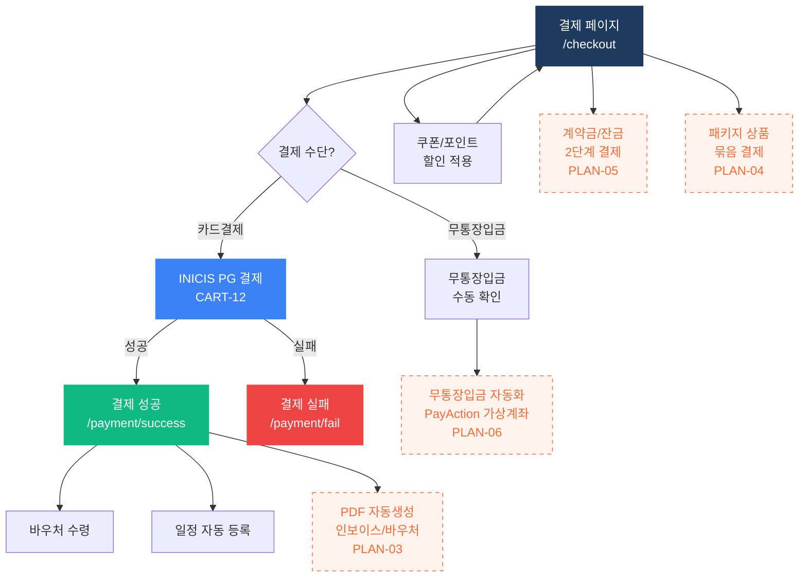

# 예약 (Book) 플로우차트

> IA 항목: BOOK-01 ~ BOOK-12, CART-01 ~ CART-12, PLAN-03 ~ PLAN-06 | 총 24개 화면 + 2차개발 4개

## 1. 예약 위자드

## 2. 장바구니

## 3. 결제 + 2차개발

> 🟠 **점선 노드**: 2차개발 항목 (추가계약 범위)

## 항목 매핑

### 예약 위자드 (BOOK)

| Page ID | 화면명 | 설명 | soft open |
|---------|--------|------|-----------|
| BOOK-01 | 여행자 정보 | 이름, 연락처[필수], 이메일[필수] | 필수 |
| BOOK-02 | 날짜 피커 | 이용일 선택 | 필수 |
| BOOK-03 | 인원 카운터 | 성인 1~20, 아동 0~20 | 필수 |
| BOOK-04 | 자동 계산 | 단가 × 인원 = 총 결제액 | 필수 |
| BOOK-05 | 이중 가격 | THB + KRW 동시 표시 | 필수 |
| BOOK-06 | 버튼 비활성화 | 필수 미입력 시 비활성화/에러 | 필수 |
| BOOK-07 | 숙박 날짜 | 체크인/체크아웃 → 박수 자동계산 | 필수 |
| BOOK-08 | 차단 날짜 | 빨간색 경고 박스 + 버튼 비활성화 | 필수 |
| BOOK-09 | 골프 폼 | 라운드 날짜/인원 입력 | 필수 |
| BOOK-10 | 차량 폼 | 서비스 유형, 픽업/드롭 정보 | 필수 |
| BOOK-11 | 예약하기 | 예약 생성 → /checkout 이동 | 필수 |
| BOOK-12 | 비회원 예약 | 연락처/이메일 필수 폼 | 필수 |

### 장바구니/결제 (CART)

| Page ID | 화면명 | 설명 | soft open |
|---------|--------|------|-----------|
| CART-01 | 장바구니 목록 | 체크박스, 상품명, 날짜, 수량, 가격 | 필수 |
| CART-02 | 전체선택 | 모든 항목 선택 | 필수 |
| CART-03 | 개별 삭제 | 휴지통 아이콘 클릭 | 필수 |
| CART-04 | 선택삭제 | 체크된 항목 일괄 삭제 | 필수 |
| CART-05 | 수량 변경 | +/- 버튼, 1~99 범위 | 필수 |
| CART-06 | 총 결제금액 | THB + KRW 이중 합산 표시 | 필수 |
| CART-07 | 빈 장바구니 | 쇼핑백 아이콘 + 안내 메시지 | 필수 |
| CART-08 | 예약대기 탭 | PENDING 상태 목록 | 필수 |
| CART-09 | 미결제 탭 | INVOICE_SENT 상태 목록 | 필수 |
| CART-10 | 결제완료 탭 | PAYMENT_COMPLETED 상태 목록 | 필수 |
| CART-11 | 예약하기 버튼 | /booking/{productId} 이동 | 필수 |
| CART-12 | INICIS 결제 | 결제 성공 → 완료 페이지 | 필수 |

### 2차개발

| Page ID | 화면명 | 설명 | soft open |
|---------|--------|------|-----------|
| PLAN-03 | PDF 자동생성 | 인보이스/바우처 서버 자동 생성 | **2차개발** |
| PLAN-04 | 패키지 상품 | 여러 상품 묶음 판매 | **2차개발** |
| PLAN-05 | 2단계 결제 | 계약금 → 잔금 분할납부 | **2차개발** |
| PLAN-06 | 무통장 자동화 | PayAction 가상계좌 자동 입금확인 | **2차개발** |

---

*[← 인덱스로 돌아가기](/p/13a43c2544094357)*
