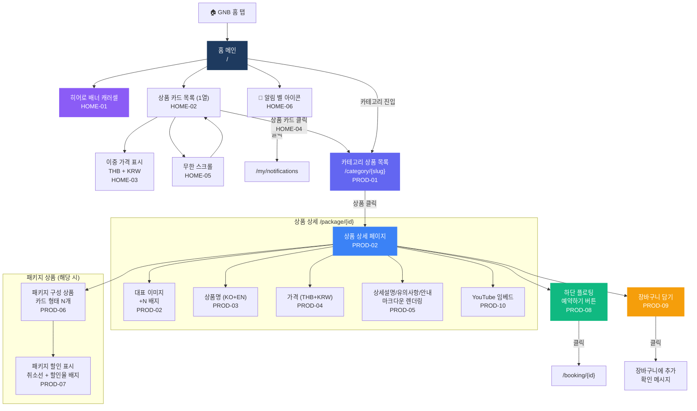
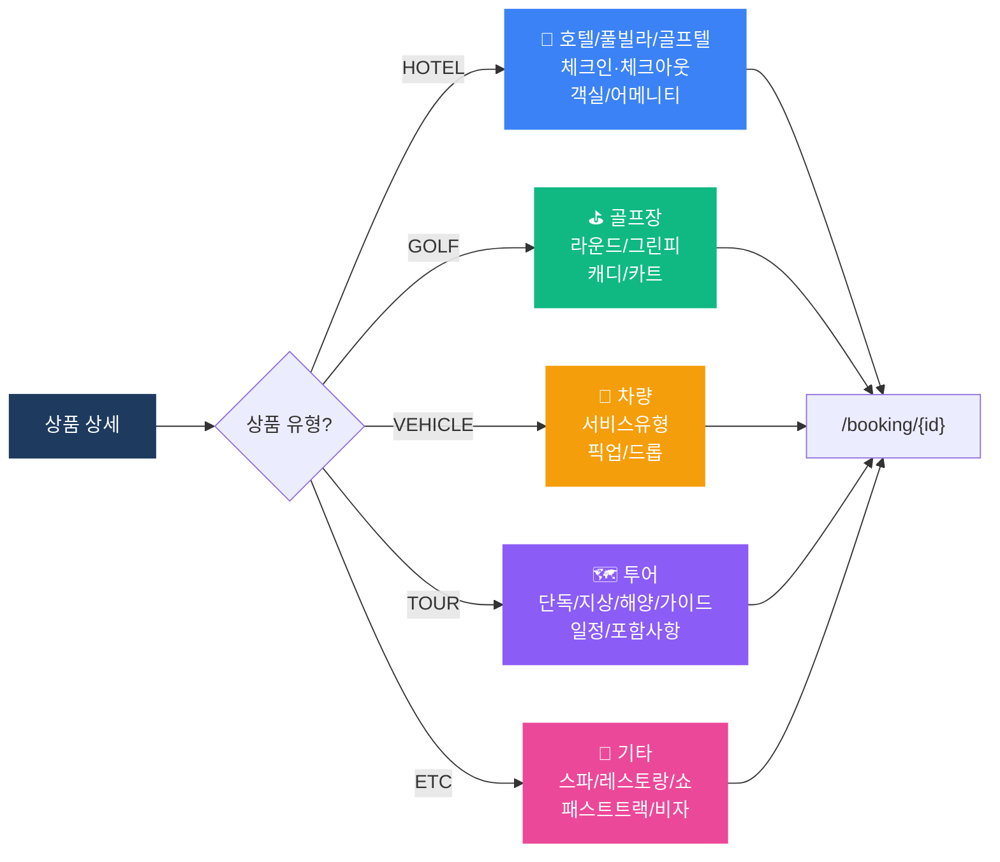

# 홈 (Home) 플로우차트

> IA 항목: HOME-01 ~ HOME-06, PROD-01 ~ PROD-10 | 총 16개 화면

## 플로우차트

## 상품 유형별 분기

## 항목 매핑

| Page ID | 화면명 | 설명 | soft open |
|---------|--------|------|-----------|
| HOME-01 | 히어로 배너 | 상단 캐러셀 배너 | 필수 |
| HOME-02 | 상품 목록 | 1열 레이아웃, 이미지/상품명/가격 | 필수 |
| HOME-03 | 이중 가격 표시 | THB + KRW 환산 가격 | 필수 |
| HOME-04 | 상품 카드 클릭 | 상품 상세 /package/{id} 이동 | 필수 |
| HOME-05 | 무한 스크롤 | 하단 스크롤 시 추가 로딩 | 필수 |
| HOME-06 | 알림 벨 아이콘 | /my/notifications 이동 | 필수 |
| PROD-01 | 카테고리 목록 | 카테고리별 상품 카드 노출 | 필수 |
| PROD-02 | 상품 상세 이미지 | 대표 이미지, +N 배지 | 필수 |
| PROD-03 | 상품명 | 한글 우선 + 영문 보조 | 필수 |
| PROD-04 | 가격 정보 | THB 판매가 + KRW 환산 이중 | 필수 |
| PROD-05 | 상세설명 | 마크다운 렌더링 (설명/유의/안내) | 필수 |
| PROD-06 | 패키지 구성 | 구성 상품 카드 N개 표시 | 필수 |
| PROD-07 | 패키지 할인 | 취소선 합산가 + 할인율 배지 | 필수 |
| PROD-08 | 예약하기 버튼 | 하단 플로팅 → /booking/{id} | 필수 |
| PROD-09 | 장바구니 담기 | 장바구니 추가 + 확인 메시지 | 필수 |
| PROD-10 | YouTube 영상 | YouTube 임베드 재생 | 필수 |

---

*[← 인덱스로 돌아가기](/p/13a43c2544094357)*
