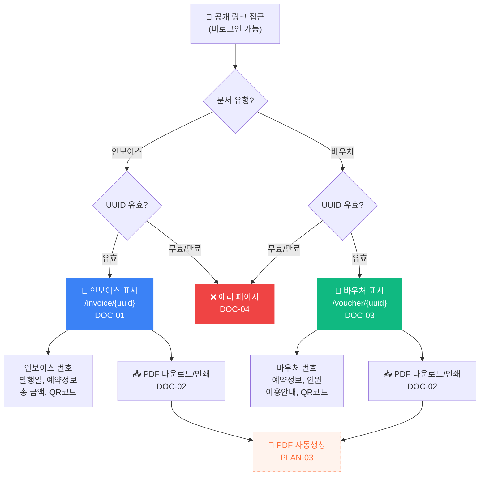

# 문서 (Doc) 플로우차트

> IA 항목: DOC-01 ~ DOC-04 + PLAN-03 | 총 4개 화면 + 2차개발 1개

## 플로우차트

> 🟠 **점선 노드**: 2차개발 항목 (추가계약 범위)

## 항목 매핑

| Page ID | 화면명 | 설명 | soft open |
|---------|--------|------|-----------|
| DOC-01 | 인보이스 | 비로그인 공개 링크, 인보이스 정보 + QR코드 | 필수 |
| DOC-02 | PDF 다운로드/인쇄 | 인쇄 대화상자 또는 PDF 다운로드 | 필수 |
| DOC-03 | 바우처 | 비로그인 공개 링크, 바우처 정보 + QR코드 | 필수 |
| DOC-04 | 에러 페이지 | 잘못된/만료된 링크 접근 시 에러 표시 | 필수 |
| PLAN-03 | PDF 자동생성 | 서버 자동 PDF 생성 | **2차개발** |

---

*[← 인덱스로 돌아가기](/p/ca28263d909c4005/13a43c2544094357)*
