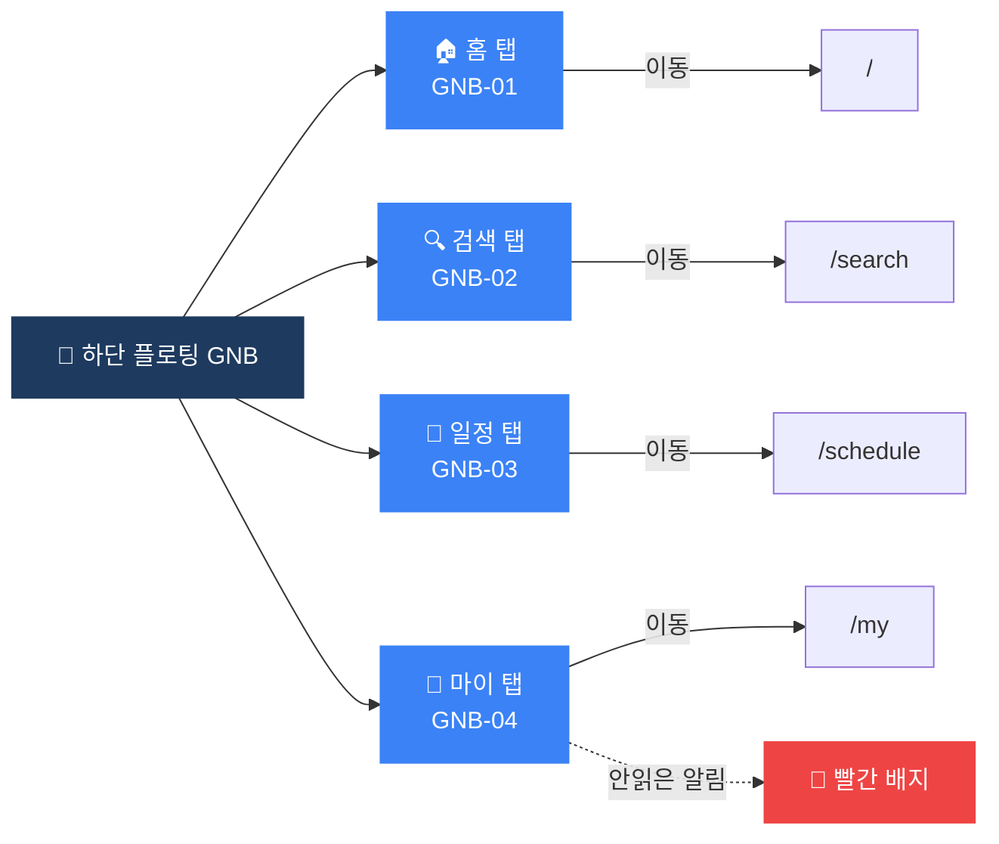

# 공통 GNB 플로우차트

> IA 항목: GNB-01 ~ GNB-04 | 총 4개 화면

## 플로우차트

## 항목 매핑

| Page ID | 화면명 | 설명 | soft open |
|---------|--------|------|-----------|
| GNB-01 | 홈 탭 | 홈(/) 페이지로 이동, 파란색 활성화 | 필수 |
| GNB-02 | 검색 탭 | 검색(/search) 페이지로 이동 | 필수 |
| GNB-03 | 일정 탭 | 일정(/schedule) 페이지로 이동 | 필수 |
| GNB-04 | 마이 탭 | 마이(/my) 페이지로 이동, 읽지 않은 알림 시 빨간 배지 | 필수 |

---

*[← 인덱스로 돌아가기](/p/ca28263d909c4005/13a43c2544094357)*
