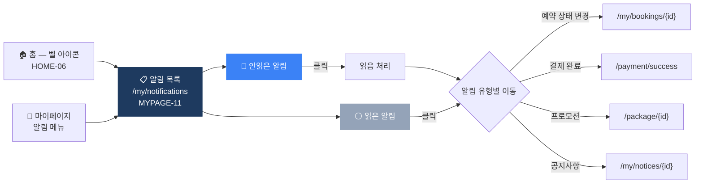

# 알림 (Alarm) 플로우차트

> IA 항목: MYPAGE-11, HOME-06 | 알림 관련 화면

## 플로우차트

## 항목 매핑

| Page ID | 화면명 | 설명 | soft open |
|---------|--------|------|-----------|
| HOME-06 | 홈 알림 벨 아이콘 | 상단 벨 아이콘 클릭 → /my/notifications 이동 | 필수 |
| MYPAGE-11 | 알림 목록 | 읽음/안읽음 구분, 클릭 시 관련 페이지 이동 | 필수 |

---

*[← 인덱스로 돌아가기](/p/ca28263d909c4005/13a43c2544094357)*
