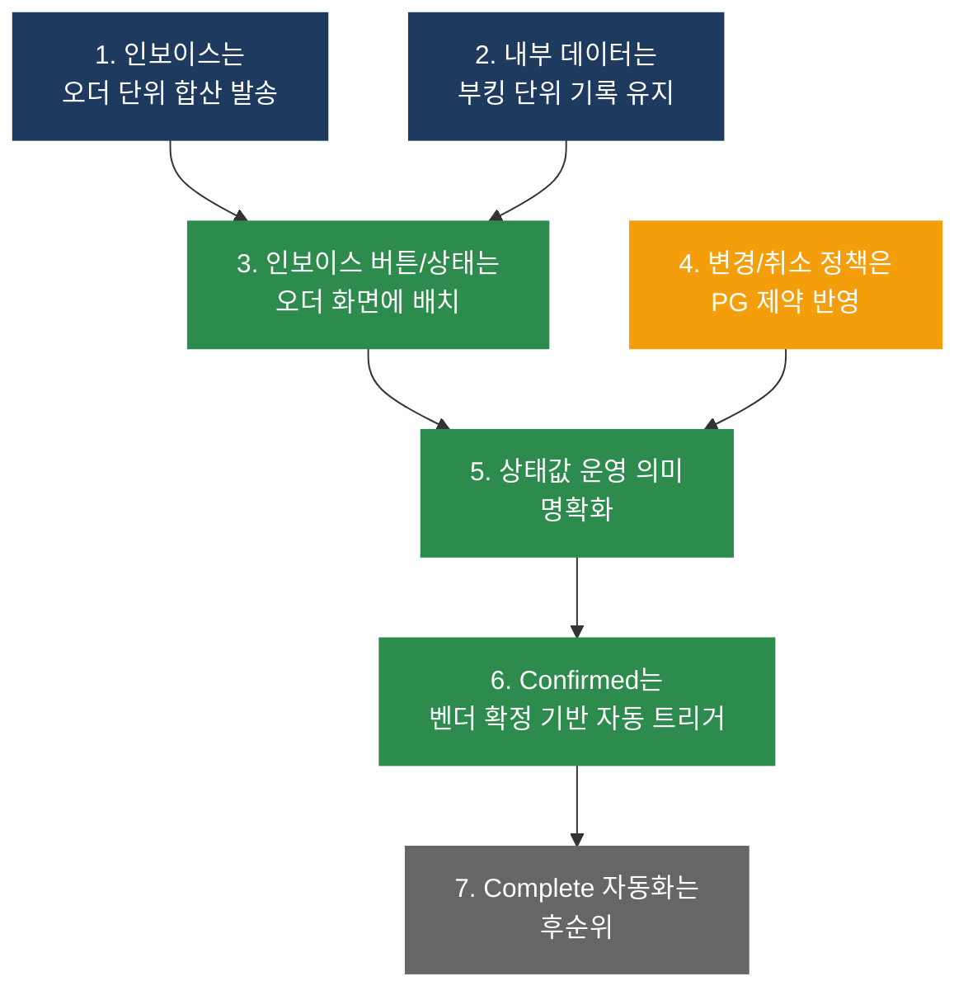
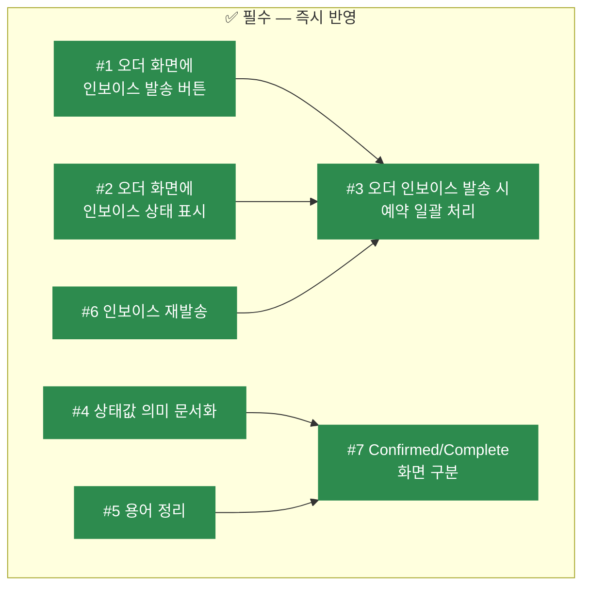
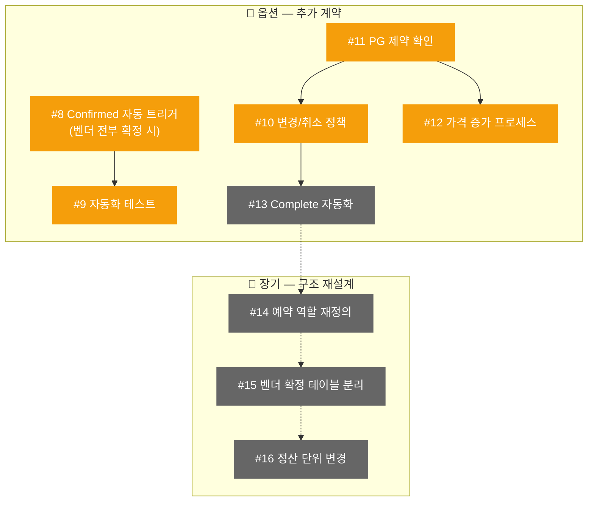
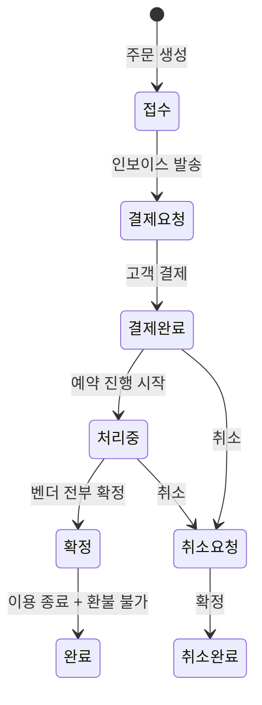
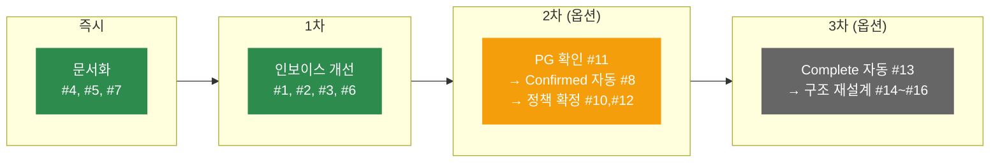

# 상태 전이 개선 계획 — 필수 vs 옵션

> **마지막 업데이트**: 2026-03-24
> **작성 근거**: 2026-03-20 온라인 미팅 (COO / DEV / PM)

---

## 1. 회의 배경

주문(Order), 예약(Booking), 인보이스(Invoice), 결제(Payment), 벤더 확정의 **상태값 구조**를 실제 운영 흐름에 맞추는 조율 회의를 진행했습니다.

### 핵심 안건 5가지

1. 오더와 부킹의 관계 정리
2. 인보이스 발송 단위 (오더 vs 부킹)
3. 부분 취소 / 변경 / 재발행 정책
4. 오더 상태값과 부킹 상태값의 의미 구분
5. 자동 트리거와 수동 처리 범위

---

## 2. 회의 결론 7가지

---

## 3. 현재 문제점

| # | 문제 | 영향 |
|---|------|------|
| 1 | 인보이스 발송 버튼이 개별 예약 화면에만 있음 | 오더 단위 발송 불가 |
| 2 | 인보이스 발행 후 예약 상태 자동 변경 안 됨 | 상태 불일치 |
| 3 | 벤더 확정해도 상위 상태 변경 안 됨 | 수동 추적 필요 |
| 4 | 주문↔예약 상태 자동 동기화 없음 | 현황 파악 어려움 |
| 5 | Processing/Confirmed/Complete 의미 불명확 | 운영 혼선 |

---

## 4. 필수 항목 (즉시 반영)

기존 구조를 유지하면서 운영에 즉시 필요한 개선 사항입니다.

### 상세 내용

| # | 항목 | 설명 | 회의 근거 |
|---|------|------|---------|
| 1 | **오더 화면에 인보이스 발송 버튼** | 주문관리 화면에서 인보이스 보내기 가능 | 액션 #2 |
| 2 | **오더 화면에 인보이스 상태 표시** | 발송 여부, 날짜, 번호 확인 가능 | 액션 #3 |
| 3 | **오더 인보이스 발송 → 예약 일괄 처리** | 오더의 모든 예약이 함께 "인보이스 발송" 상태로 전환 | 액션 #4 |
| 4 | **상태값 운영 의미 문서화** | Paid/Processing/Confirmed/Complete 정의 확정 | 액션 #6 |
| 5 | **용어 정리** | Reservation/Booking/Order 등 명칭 통일 | 액션 #15 |
| 6 | **인보이스 재발송** | 운영자가 예약 내용 수정 후 인보이스 재발송 가능 | 액션 #5 |
| 7 | **Confirmed/Complete 화면 구분** | 두 상태의 운영 의미를 화면에 명확히 표시 | 액션 #12 |

---

## 5. 옵션 항목 (추가 계약 시 반영)

구조적 변경이 필요하거나 정책 확정이 선행되어야 하는 항목입니다.

### 상세 내용

| # | 항목 | 설명 | 선행 조건 |
|---|------|------|---------|
| 8 | **Confirmed 자동 트리거** | 모든 예약의 벤더가 확정되면 오더 자동 Confirmed | — |
| 9 | **자동화 테스트** | 위 자동 트리거의 정합성 검증 | #8 완료 |
| 10 | **변경/취소 정책 시스템화** | 부분 취소 범위, 가격 증감 처리 정책 | #11 완료 |
| 11 | **PG 제약 확인** | 이니시스 부분 취소/추가 결제 가능 여부 | — |
| 12 | **가격 증가 프로세스** | 추가 결제 vs 취소 후 재결제 정책 확정 | #11 완료 |
| 13 | **Complete 자동 전환** | 이용일 경과 시 자동 완료 (배치/cron) | 인프라 검토 |
| 14 | **예약 역할 재정의** | 인보이스/바우처 상태를 예약에서 분리 | 대규모 리팩토링 |
| 15 | **벤더 확정 테이블 분리** | 벤더 요청 이력 관리 (현재 단일 값) | 신규 테이블 |
| 16 | **정산 단위 변경** | 공급처+기간 → 예약 건별 정산으로 전환 | 정산 재설계 |

---

## 6. 상태값 운영 의미 정의

회의에서 확정된 각 상태의 **운영 관점** 정의입니다.

| 상태 | 영문 | 운영 의미 | 비유 |
|------|------|---------|------|
| **결제 요청** | Payment Requested | 고객에게 결제 요청이 나간 상태 (인보이스 발송) | 청구서 발송 |
| **결제 완료** | Paid | 고객이 결제를 완료한 상태 | 돈 들어옴 |
| **처리 중** | Processing | 내부적으로 실제 예약 진행 중 (벤더 확정 대기) | 주문 처리 중 |
| **확정** | Confirmed | 모든 예약의 벤더가 확정 완료. 호텔/차량/상품 확보 완료. 아직 여행 시작 전일 수 있음 | 발송 완료 |
| **완료** | Complete | 고객이 실제 이용까지 마침. 취소/환불 불가 시점 경과 | 배송 완료 |

> **핵심 차이**: Confirmed는 "예약이 확보된 상태"이고, Complete는 "이용이 끝난 상태"입니다.
> 쇼핑에 비유하면 Confirmed = 발송 완료, Complete = 배송 완료입니다.

---

## 7. 용어 사전

| 용어 | 시스템 이름 | 설명 |
|------|-----------|------|
| **주문** | Order | 고객이 장바구니에서 한 번에 결제하는 단위. 여러 예약을 묶음 |
| **예약** | Booking | 개별 상품 예약 건. 가격/벤더/상태의 최소 관리 단위 |
| **인보이스 발송** | Invoice Sent | 오더 단위로 고객에게 청구서를 보낸 상태 |
| **결제 요청** | Payment Requested | Invoice Sent와 동일한 의미 |
| **벤더 확정** | Vendor Confirmed | 개별 예약에 대해 공급처가 가능을 확인한 상태 |
| **예약 확정** | Confirmed | 오더 내 모든 예약의 벤더가 확정된 상태 |

---

## 8. 구현 순서

---

## 9. 회의 액션아이템 전체 매핑

> **업데이트**: 2026-03-26 — 15개 중 11개 구현 완료

| 회의 # | 액션 | 분류 | 상태 | 본 문서 # |
|--------|------|------|------|---------|
| 1 | 인보이스 발송 단위 오더 기준 합산 | 필수 | **구현 완료** | 1, 3 |
| 2 | 주문관리 화면에 인보이스 버튼 | 필수 | **구현 완료** | 1 |
| 3 | 주문관리 화면에 발송 상태 표시 | 필수 | **구현 완료** | 2 |
| 4 | 인보이스 발송 시 예약 일괄 처리 | 필수 | **구현 완료** | 3 |
| 5 | 운영자 수정 후 재발송 | 필수 | **구현 완료** | 6 |
| 6 | 상태값 정의 문서화 | 필수 | **구현 완료** | 4 |
| 7 | Confirmed 자동 트리거 | 옵션→필수 | **구현 완료** | 8 |
| 8 | 자동화 테스트 케이스 | 옵션→필수 | **구현 완료** (S22 TC 16건) | 9 |
| 9 | 변경/취소 정책 정리 | 옵션 | 미적용 (COO 정책 확정 필요) | 10 |
| 10 | 이니시스 PG 제약 확인 | 옵션 | 미적용 (PG API 조사 필요) | 11 |
| 11 | 가격 증가 프로세스 정책 | 옵션 | 미적용 (#10 결과 후 결정) | 12 |
| 12 | Confirmed/Complete 화면 반영 | 필수 | **구현 완료** | 7 |
| 13 | Complete 자동화 검토 | 옵션 | 미적용 (cron/인프라 필요) | 13 |
| 14 | 개발 이슈 등록 | 필수 | **구현 완료** | 이 문서 |
| 15 | 용어 통일 | 필수 | **구현 완료** | 5 |
