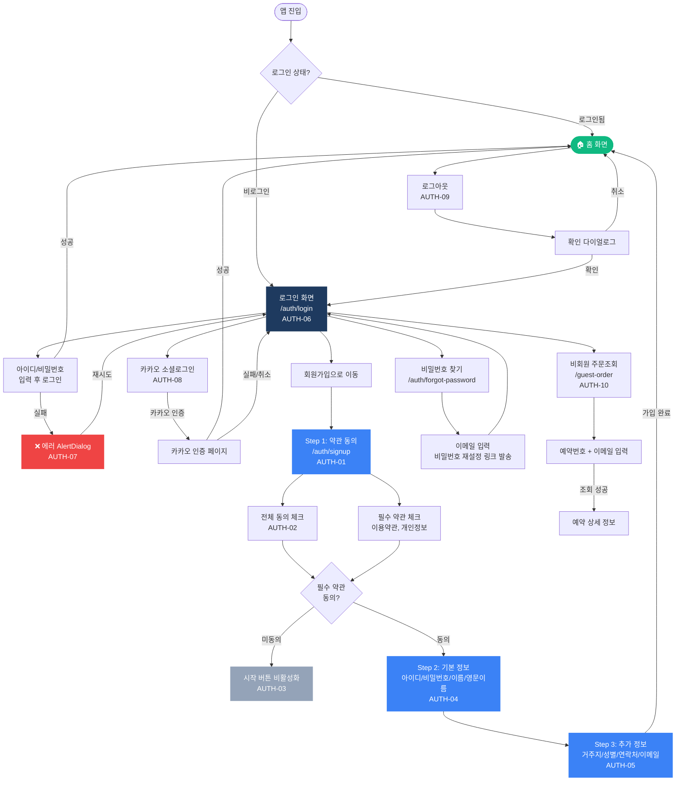

# 인증 (Auth) 플로우차트

> IA 항목: AUTH-01 ~ AUTH-10 | 총 10개 화면

## 플로우차트

## 항목 매핑

| Page ID | 화면명 | 설명 | soft open |
|---------|--------|------|-----------|
| AUTH-01 | 회원가입 약관 동의 | Step 1 — 이용약관, 개인정보, 마케팅 체크박스 | 필수 |
| AUTH-02 | 전체 동의 | 전체 동의 체크박스 클릭 → 3개 모두 선택 | 필수 |
| AUTH-03 | 필수 약관 미동의 | 시작 버튼 비활성화 | 필수 |
| AUTH-04 | 기본 정보 입력 | Step 2 — 아이디, 비밀번호, 이름, 영문이름 | 필수 |
| AUTH-05 | 추가 정보 입력 | Step 3 — 거주지, 성별, 연락처, 이메일 | 필수 |
| AUTH-06 | 로그인 | 아이디/비밀번호 입력 → 로그인 성공 시 홈 이동 | 필수 |
| AUTH-07 | 로그인 실패 | 잘못된 비밀번호 → AlertDialog 에러 | 필수 |
| AUTH-08 | 카카오 소셜로그인 | 카카오 인증 페이지 이동 → 성공 시 홈 | 필수 |
| AUTH-09 | 로그아웃 | 확인 다이얼로그 → 비로그인 상태 전환 | 필수 |
| AUTH-10 | 비회원 주문조회 | 예약번호 + 이메일 → 예약 상세 표시 | 필수 |

---

*[← 인덱스로 돌아가기](/p/ca28263d909c4005/13a43c2544094357)*
