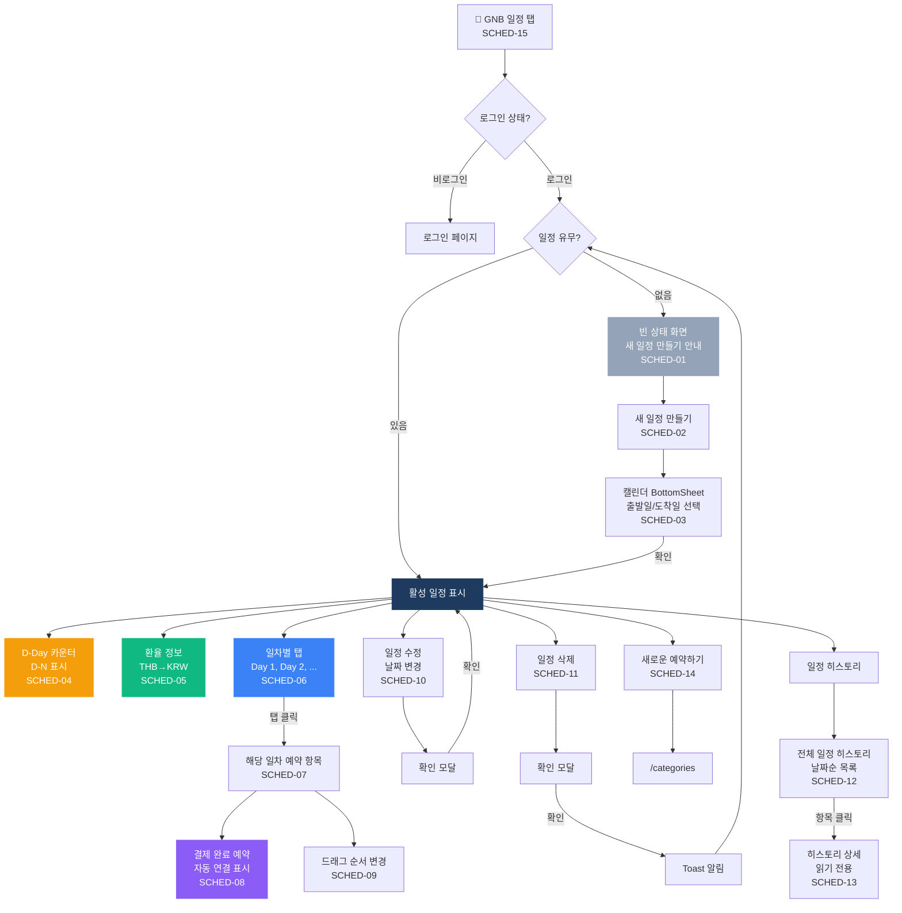

# 일정 (Schedule) 플로우차트

> IA 항목: SCHED-01 ~ SCHED-15 | 총 15개 화면

## 플로우차트

## 항목 매핑

| Page ID | 화면명 | 설명 | soft open |
|---------|--------|------|-----------|
| SCHED-01 | 빈 상태 | 일정 없음 → 새 일정 만들기 안내 | 필수 |
| SCHED-02 | 새 일정 만들기 | 캘린더 BottomSheet 열기 | 필수 |
| SCHED-03 | 날짜 선택 | 출발일/도착일 선택 → 일정 생성 | 필수 |
| SCHED-04 | D-Day 카운터 | 여행 시작일까지 D-N 표시 | 필수 |
| SCHED-05 | 환율 정보 | THB→KRW 현재 환율 표시 | 필수 |
| SCHED-06 | 일차별 탭 | Day 1, Day 2, ... 탭 표시 | 필수 |
| SCHED-07 | 탭 네비게이션 | 일차 탭 클릭 → 해당 일차 예약 항목 | 필수 |
| SCHED-08 | 자동 예약 표시 | 결제 완료 상품 자동 연결 | 필수 |
| SCHED-09 | 순서 변경 | 드래그로 일차 내 항목 순서 변경 | 필수 |
| SCHED-10 | 일정 수정 | 날짜 변경 → 확인 모달 | 필수 |
| SCHED-11 | 일정 삭제 | 확인 모달 → Toast 알림 | 필수 |
| SCHED-12 | 일정 히스토리 | 과거 일정 날짜순 목록 | 필수 |
| SCHED-13 | 히스토리 상세 | 읽기 전용 상세 보기 | 필수 |
| SCHED-14 | 새로운 예약하기 | /categories 이동 | 필수 |
| SCHED-15 | GNB 일정 탭 | /schedule 이동 | 필수 |

---

*[← 인덱스로 돌아가기](/p/13a43c2544094357)*
