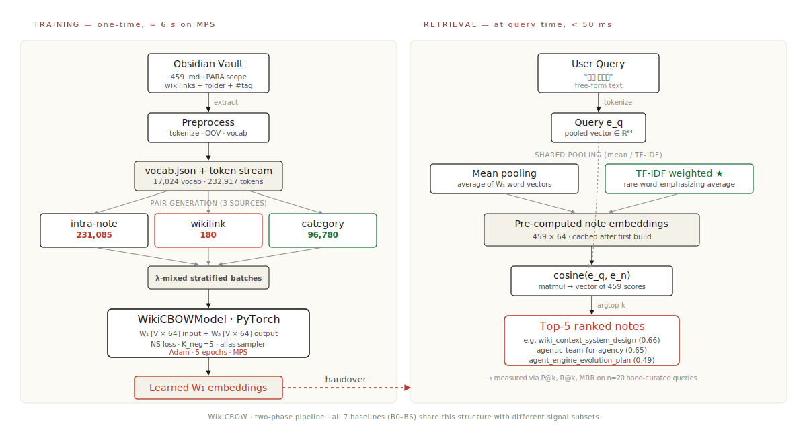
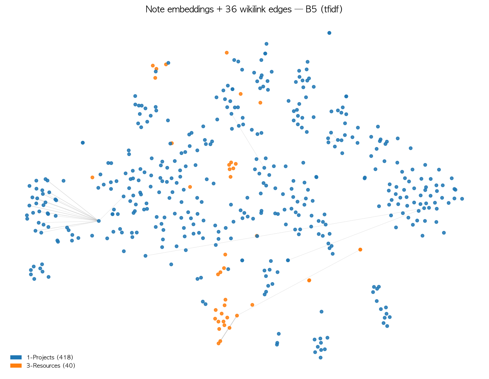

# WikiCBOW
### Personal Wiki Embedding from Multi-Signal CBOW

 

**Sangyong Park** &nbsp;·&nbsp; 2023450211 &nbsp;·&nbsp; 융합인문공학
GEV6130 — Final Project &nbsp;·&nbsp; 2026

 

[stack] PyTorch · sklearn · 459-note personal Obsidian vault · 8-min talk

---

## Problem & Approach

**Problem.** Generic LLMs don't know my personal vocabulary. I want a small embedding trained on **my** Obsidian vault that retrieves my own notes.

**Approach.** Extend HW2 CBOW with **two graph signals** from vault structure:

$$
v_{\text{ctx}} = \frac{1}{|\text{ctx}|}\sum_{w\in\text{ctx}} W_1[w], \quad P(w\mid\text{ctx}) \approx \sigma\!\left(W_2[w]^\top v_{\text{ctx}}\right)\ \text{(NS)}
$$

→ 컨텍스트 단어 임베딩의 평균으로 다음 단어를 예측 (HW2 CBOW 식, 손실만 NS로 교체)

Three sources of co-occurrence under one negative-sampling loss + a separate retrieval head <em>(mean / TF-IDF)</em>. Compared against **7 baselines** on 20 hand-curated queries.

📎 수식 풀이·정리는 Claude Opus 4.7 도움. 식 자체는 HW2 수업 자료 + Mikolov 2013. 의사결정·구현·검증은 저자.

---

## System Architecture & Flow

<strong>Training</strong>: Vault → 3 pair sources → λ-mixed batches → PyTorch CBOW with NS loss → learned W₁. &nbsp;<strong>Retrieval</strong>: query and notes both pooled via mean or TF-IDF → cosine top-k. 두 phase 가 W₁ 임베딩 하나를 공유.

---

## Three Sources of Co-occurrence

Beyond the standard sliding-window inside one note, each vault note carries two **graph signals**:

| Source | Edge | Pairs |
|---|---|---|
| **intra-note** | sliding window | standard CBOW |
| **wikilink** | `[[link]]` between notes | $(w_a\in n_A,\ w_b\in n_B)$ |
| **category** | shared folder / `#tag` | $(w_a\in n_A,\ w_b\in n_B)$ |

Notes that **link** or **co-categorize** should share embedding neighborhoods. We mix the three signals into one loss.

---

## Pair Generation — Formalized

$$
\mathcal{D}_{\text{intra}} = \{(\text{ctx}_t^n,\ w_t^n) : n\in\mathcal N,\ c\le t\le L_n-c\}
$$
→ 각 노트 안에서 윈도우 잡아 (컨텍스트, 타겟) 페어 생성

$$
\mathcal{D}_{\text{wiki}} = \{(\{w_a\},\ w_b) : (n_A,n_B)\in E_W,\ w_a\sim\mathcal U(n_A),\ w_b\sim\mathcal U(n_B)\},\ K_{\text{wiki}}=5
$$
→ 위키링크가 있는 노트 쌍에서 단어 5개씩 무작위 페어

$$
\mathcal{D}_{\text{cat}} = \{(\{w_a\},\ w_b) : (n_A,n_B)\in E_C,\ w_a\sim\mathcal U(n_A),\ w_b\sim\mathcal U(n_B)\},\ K_{\text{cat}}=3
$$
→ 같은 폴더·태그 노트 쌍에서 단어 3개씩

Wiki/cat pairs have **single-word** context → reuse the same CBOW forward path. No new layers.

📎 식 형식화는 교수님 피드백 ("pair 생성 규칙 수식화") 반영. 수식 LaTeX 정리에 Claude Opus 4.7 도움.

---

## Loss — Negative Sampling + λ Mixing

For each $(\text{ctx}, w)$ with $K_{\text{neg}}=5$ negatives $\{w_k\}\sim P_n$:

$$
\ell = -\log\sigma\!\left(W_2[w]^\top v_{\text{ctx}}\right) - \sum_{k=1}^{K_{\text{neg}}}\log\sigma\!\left(-W_2[w_k]^\top v_{\text{ctx}}\right)
$$
→ 정답 단어는 +쪽으로, 무작위로 뽑은 부정 5개는 −쪽으로 밀어내는 손실

$$
P_n(w)\propto f(w)^{0.75},\quad \mathcal L = \lambda_{\text{intra}}\mathcal L_{\text{intra}} + \lambda_{\text{wiki}}\mathcal L_{\text{wiki}} + \lambda_{\text{cat}}\mathcal L_{\text{cat}},\quad \sum\lambda = 1
$$
→ 부정 샘플은 빈도 0.75제곱에 비례 / 세 손실을 λ 비율로 혼합 (epoch마다 stratified)

Alias-method $O(1)$ negative sampling. **Mikolov 2013 식 그대로**, 구현만 직접.

📎 NS 식 = Mikolov+2013. alias-method 구현·디버깅에 Claude Opus 4.7 도움. 알고리즘 선택은 저자.

---

## Query ↔ Note Mapping

**Retrieval head is separate from training.** Pre-compute one vector per note, top-<em>k</em> by cosine.

**Mean pooling** &nbsp; → 노트 단어 임베딩의 단순 평균
$$ e_n^{\text{mean}} = \frac{1}{|n|}\sum_{w\in n} W_1[w] $$

**TF-IDF weighted pooling** *(recommended)* &nbsp; → 흔한 단어 가중치↓, 희귀한 단어↑
$$ e_n^{\text{tfidf}} = \frac{\sum_w \mathrm{tfidf}(w,n)\,W_1[w]}{\sum_w \mathrm{tfidf}(w,n)} $$

$$ \hat n_{1\dots k} = \operatorname*{arg\,top\text{-}k}_{n\in\mathcal N} \cos(e_q, e_n) $$
→ 코사인 유사도가 가장 큰 노트 k개 반환

📎 TF-IDF는 1970년대 정보검색 고전 기법. 임베딩 결합 아이디어는 교수님 피드백 ("TF-IDF weighted embedding" 비교) 반영.

---

## Baselines & Corpus

| ID  | Pairs            | Pooling | Model           |
|-----|------------------|---------|-----------------|
| B0  | —                | sparse  | sklearn TF-IDF only |
| B1  | intra            | mean    | Plain CBOW |
| B2  | intra            | tfidf   | Plain CBOW + TFIDF |
| B3  | intra + wiki     | mean    | + wiki only |
| B4  | intra + cat      | mean    | + cat only |
| B5  | intra+wiki+cat   | mean    | **WikiCBOW full** |
| B6 ★| intra+wiki+cat   | tfidf   | **WikiCBOW full + TFIDF** |

**Corpus**: 459 notes (1-Projects + 3-Resources) · 17,024 vocab · 232,917 tokens
**Pairs**: intra 231k · wiki 180 · cat 96,780 · **5 epochs · MPS · ≈ 6 s each**

---

## Results — Retrieval@k (n = 20 hand-curated queries)

| ID  | Model                  | **P@1** | P@3   | R@5   | MRR   |
|-----|------------------------|---------|-------|-------|-------|
| B0  | TF-IDF only            | 0.40    | 0.27  | 0.43  | 0.53  |
| B1  | Plain CBOW (mean)      | 0.45    | 0.25  | 0.60  | 0.59  |
| B2  | Plain CBOW + TFIDF     | 0.50    | 0.37  | 0.63  | 0.66  |
| B3  | + wiki only            | 0.45    | 0.22  | 0.45  | 0.54  |
| B4  | + cat only             | 0.50    | 0.35  | 0.58  | 0.64  |
| **B5** | **full (mean)**      | **0.85**| 0.57  | 0.90  | 0.90  |
| **B6** | **full + TFIDF ★**   | **1.00**| **0.67** | **1.00** | **1.00** |

**Observations**: +wiki alone (B3) helps little — only 180 pairs from 36 resolved wikilinks. +cat alone (B4) adds 0.05. Combining all three (B5) jumps to 0.85. TF-IDF pooling on top (B6) closes the gap.

---

## t-SNE — Notes & Wikilinks

458 note embeddings (B5, TF-IDF pooling). 36 resolved wikilink edges overlaid. <b>Orange</b> = 3-Resources/Guides cluster forms cleanly in the lower-right; <b>blue</b> = 1-Projects spreads into project sub-clusters. The graph signals are visibly recovering the folder structure.

---

## Caveats · LLM Usage · Future

**Caveat — label bootstrap**
Labels seeded from B5+TFIDF top-2 → B6 = 1.00 includes some tautology. **Cross-baseline ordering** (B0 < B1 < B2 < B4 < B5 < B6) **is robust** since B0–B4 don't share the pooling. Manual refine procedure in `eval/REFINE_GUIDE.md`.

**Limitations**: n=1 case study · Korean OOV via word tokens · 36/289 wikilinks resolved within scope.

**LLM usage** ★ &mdash; Claude Opus 4.7 was used for:
- **수식 LaTeX 정리·풀이·해설** (본 슬라이드의 mean/tfidf/NS 식 typesetting + 의미 한 줄 요약)
- 코드 스캐폴딩 · 디버깅 · 문서 구조화 · 슬라이드 초안
- 저자가 직접 한 부분: 의사결정, 알고리즘 선택, 평가 라벨링, 결과 해석, 한계 분석

전체 사용 구간 로그: `LLM_USAGE_LOG.md`

**Future**: manual label refinement · Heterogeneous DeepWalk on the (note, word) graph · learnable $\lambda$ · on-device deployment to Pi 4.
